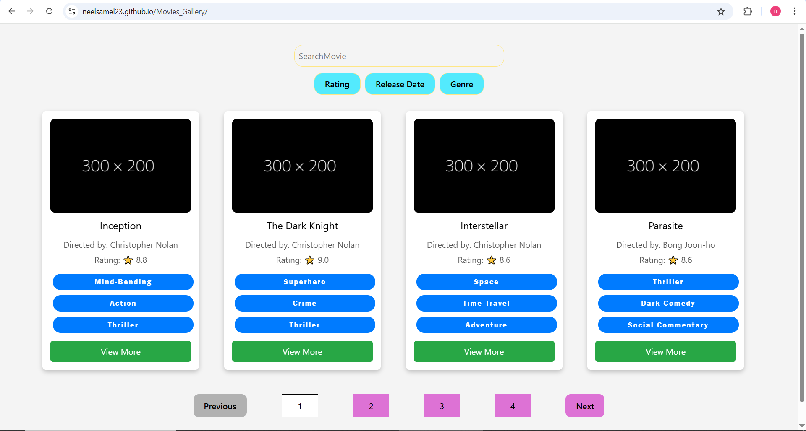

# Movies_Gallery

# 🎬 Movies Gallery App

A responsive and dynamic Movies Gallery web application that displays movies with filtering, sorting, and pagination features. Built using **HTML**, **Tailwind CSS**, and **JavaScript**.

🌐 **Live Link**: [Movies Gallery](https://neelsamel23.github.io/Movies_Gallery/)

---

## 📁 Project Structure

Movies_Gallery/
├── .vscode/ # VS Code settings
├── node_modules/ # Project dependencies
├── index.html # Main HTML file
├── input.css # Tailwind input styles
├── output.css # Compiled Tailwind CSS
├── style.css # Custom styles 
├── script.js # Main JavaScript logic
├── movies.json # Static movie data (used for local testing)
├── tailwind.config.js # Tailwind configuration
├── package.json # Project metadata and dependencies
├── package-lock.json # Dependency lockfile
├── bun.lockb # Bun lockfile (if used)
├── LICENSE # Project license
├── README.md # Project documentation

---

## 🚀 Features

- 🔁 **Real-Time Movie Rendering** (via Firebase or local JSON)
- 🔍 **Search** by title, genre, or tags
- ⬇️ **Sort** by rating, release date, or genre
- 📄 **Pagination** (4 movies per page)
- 🖼️ **Responsive Card Layout**
- 📂 **Fallback Support** for missing data
- 💡 **View More Toggle** to show/hide extra movie details
- ⚙️ **Tailwind CSS** for responsive styling

---

## 🧰 Technologies Used

- HTML5
- Tailwind CSS
- JavaScript (ES6)
- Firebase Realtime Database (optional)
- Bun or npm (for build and dependencies)

---

## 📦 How to Run Locally

🚀 Getting Started
1. Clone the Repository
bash
Copy
Edit
git clone https://github.com/neelsamel23/Movies_Gallery.git
cd Movies_Gallery
2. Run the Project Locally
🖥️ If you're using VS Code:
Open the folder in VS Code:

code .
Open index.html manually or via the Explorer.

Press Alt + L followed by Alt + O
(This opens the file with the Live Server extension — make sure it’s installed).

📸 Project Preview

🧾 License
This project is licensed under the MIT License.
See the LICENSE file for details.

🙋‍♂️ Author
Neel Samel
GitHub: @neelsamel23
